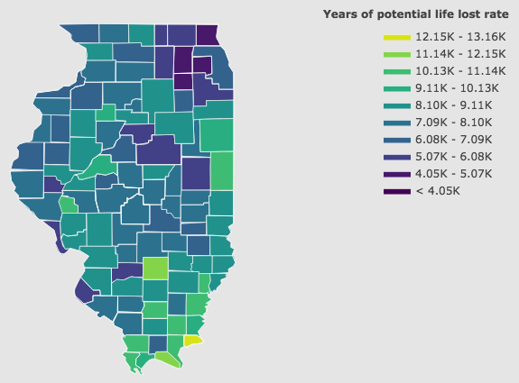

# Social Determinants of Health

That factors like our day to day behavior and genetics affect our overall health outcomes is common knowledge. In recent decades, though, there's been a growing understanding that a person's health is tied to factors outside of their individual risk factors. Our health is also greatly influenced by determinants that we inherit from the economic and social conditions in which we exist. 

Insights into these determinants require connecting data from the individual level onto a larger collective scale, in order to paint a picture of the social influences that influence health outcomes. A really awesome sorce of data of this sort comes The the County Health Rankings & Roadmaps program, a collaboration between the Robert Wood Johnson Foundation and the University of Wisconsin Population Health Institute from which joins data from 20 different sources across the CDC, Census Bureau, Agriculture Department, FBI, and even the transportation department. 

This allows a county level comparison of social factors and health outcomes:

 

*Income is anti-correlated with household income*

I'm going to use this repository to collect some of my exploration of this and other data related to the social determinants of health.

## The Data

The data is organized into rankings at the county level. 
They provide rankings for Health Outcomes as well as Health Factors.
Beyond that, they provide sub rankings for the factors and outcomes which consist of: *Length of Life, Quality of Life, Health Behaviors, Clinical Care, Social & Economic Factors, and Physical Environment*.

But it goes further: there is data for all of the measurements that go into these rankings, as well as additional measurements. 
All of this amounts to a great source of information about county health outcomes and factors.

## Exploring the Data

To begin with, I think it's a good idea to manually go through the variables, read their description, and try to decide what factors are of interest. 
I first separated the factors into classes, such as social factors, behavioral factors, and outcomes.
To get an initial sense of the data, and how it might paint a picture of social determinants, I selected behavioral and social factors, and chose to focus on one outcome: *Years of Potential Life Lost Rate*.

After cleaning up the data, it's a good idea to take a look at the variance among the data and try to pick out correlations between the different factors.

Here's the correlation matrix:

There are a couple of things to notice right off the bat. The dimensionality of this set can probably be reduced, as some of these data points probably overlap a lot in information. For example, the size of the Hispanic population is very correlated with the non-English speaking population. In the United States, [Spanish is by far the most commonly spoken language outside of English](https://en.wikipedia.org/wiki/Languages_of_the_United_States). Likewise, there is of course a strong anti-correlation with household income, and children living in poverty. In other words, there's a high potential for dimensionality reduction.

Another interesting thing to note is that many behavioral factors are highly correlelated with social factors. 
It's common knowledge that behaviors such as smoking are highly predictive of health outcomes. 
It's important to note though, that this data suggests smoking itself is highly correlated with reports of mental distress and food insecurity, and negatively correlated with household income, which are all classified as social determinants.
So, it's really an interrelationship among classes of factors that determine individual and population health.

### Feature Importance

#### Correlations

The coarsest and quickest way to get a sense of the feature importance is by looking at the correlation matrix to see which features most strongly correlate with the outcome. 
Two factors which pop out immediately are *% Children in Poverty* and *Household Income*.

#### Random Forrest Toy Model

To take it one step farther, it's often useful to pick a toy model to explore the data with.
I'm going to use a random forrest regressor.
Right out of the box, I don't expect to get the best predictions, but it should be good enough to poke at the data with.
One thing we can do is look at the features that are most important at explaining the *Years of Potentail Life Lost* for this model:

### F-score

### Mutual Information

### Drop Columns

